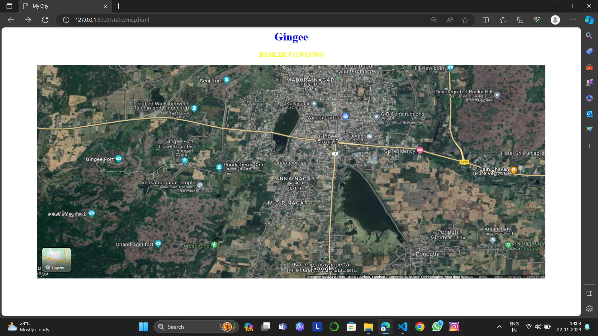

# Ex04 Places Around Me
## Date:15.11.2023
## AIM
To develop a website to display details about the places around my house.

## DESIGN STEPS

### STEP 1
Create a Django admin interface.

### STEP 2
Download your city map from Google.

### STEP 3
Using ```<map>``` tag name the map.

### STEP 4
Create clickable regions in the image using ```<area>``` tag.

### STEP 5
Write HTML programs for all the regions identified.

### STEP 6
Execute the programs and publish them.

## CODE
```
map.html

<html>
<head>
<title>My City</title>
</head>
<body>
<h1 align="center">
<font color="blue"><b>Gingee</b></font>
</h1>
<h3 align="center">
<font color="yellow"><b>BASKAR J (23013386)</b></font>
</h3>
<center>

<map name="MyCity">
<area shape="rect" coords="800,180,850,250" href="home.html" title="My Home Town">
<area shape="rect" coords="170,220,250,300" href="Gingee.html" title="Gingee Fort">
<area shape="rect" coords="500,30,550,70" href="Senji.html" title="Senji fort">
<area shape="rect" coords="1100,450,1200,500" href="Ponpatti.html" title="Ponpatti">
<area shape="rect" coords="1320,280,1370,320" href="Jain.html" title=" jain Bhavan">
</map>
</center>
</body>
</html>

home.html

<html>
<head>
<title>My Home Town</title>
</head>
<body bgcolor="pink">
<h1 align="center">
<font color="red"><b>Gingee</b></font>
</h1>
<h3 align="center">
<font color="blue"><b>Gingee - My Home Town</b></font>
</h3>
<hr size="3" color="red">
<p align="justify">
<font face="Georgia" size="5">
Gingee is a Town Panchayat city in district of Viluppuram, Tamil Nadu. The Gingee city is divided into 18 wards for which elections are held
every 5 years. The Gingee Town Panchayat has population of 27,045 of which 13,696 are males while 13,349 are females as per report released by
Census India 2011.Population of Children with age of 0-6 is 2893 which is 10.70 % of total population of Gingee (TP). In Gingee Town Panchayat,
Female Sex Ratio is of 975 against state average of 996. Moreover Child Sex Ratio in Gingee is around 968 compared to Tamil Nadu state average 
of 943. Literacy rate of Gingee city is 85.60 % higher than state average of 80.09 %. In Gingee, Male literacy is around 90.58 % while female 
literacy rate is 80.49 %.

<style>
    .centerimage{
    display: block;
    margin-left:auto;
    margin-right: auto;
    }
    </style>
    

</font>
</p>
</body>
</html>

gingee.html

<html>
<head>
<title>My Home Town</title>
</head>
<body bgcolor="purple">
<h1 align="center">
<font color="cyan"><b>Gingee</b></font>
</h1>
<h3 align="center">
<font color="lime"><b>Gingee - Fort</b></font>
</h3>
<hr size="3" color="red">
<p align="justify">
<font face="Georgia" size="5" color="white">
Gingee Fort or Senji Fort (also known as Chenji, Chanchi, Jinji or Senchi) in Tamil Nadu, India is one of the surviving forts in Tamil Nadu,
India. It lies in Villupuram District, 160 kilometres (99 mi) from the state capital, Chennai, and is close to the Union Territory of 
Puducherry. The fort is so fortified, that Shivaji, the Maratha king, ranked it as the "most impregnable fortress in India" and it was called 
the "Troy of the East" by the British. The nearest town with a railway station is Tindivanam and the nearest airport is Chennai (Madras), 
located 150 kilometres(93mi)away.Originally the site of a small fort built by the Chola dynasty during the 9th century AD, Gingee Fort was 
modified by Kurumbar during the 13th century. As per one account, the fort was built during the 15-16th century by the Nayaks, the lieutenants 
of the Vijayanagara Empire and who later became independent kings (Nayaks of Gingee ). The fort passed to the Marathas under the leadership of 
Shivaji in 1677 AD, Bijapur sultans, the Moghuls, Carnatic Nawabs, French and the British in 1761. The fort is closely associated with 
Raja Tej Singh, who unsuccessfully revolted against the Nawab of Arcot and eventually lost his life in abattle.

<style>
    .centerimage{
    display: block;
    margin-left:auto;
    margin-right: auto;
    }
    </style>
    

</font>
</p>
</body>
</html>


senji.html

<html>
<head>
<title>My Home Town</title>
</head>
<body bgcolor="yellow">
<h1 align="center">
<font color="red"><b>Gingee</b></font>
</h1>
<h3 align="center">
<font color="blue"><b>Senji - Fort</b></font>
</h3>
<hr size="3" color="red">
<p align="justify">
<font face="Georgia" size="5">
The Three Hills - The Three Citadels
As already mentioned the Gingee Fort complex is situated on three hillocks. In fact all the three hills together constitute a fort complex, yet 
each hill contains a separate and self contained fort. The first hill, where the main fort is located, is called Rajagiri. Originally it was known 
as Kamalagiri as well as Anandagiri. The fort here is most impregnable. It is about 800 ft. in height. Its summit is cut off from communication and
is surrounded by a deep, natural chasm that is about 10 yards wide and 20 yards deep. To gain entry into the citadel one had to cross the chasm 
with the help of a small wooden draw bridge which was drawn only after getting a signal from the sentries on the parapets that a friend was 
approaching.The naturally strong rock on which the fortress is located is further strengthened by the construction of embrasure walls and gateways 
along all possible shelves and precipitous edges. It forms the principal fortification. Seven gates have to be traversed before reaching the 
citadel. This citadel contains many important buildings apart from the living quarters of the royalty, like the stables, granaries, and meeting 
halls for the public, temples, mosques, shrines and pavilions jostling each other.

<style>
    .centerimage{
    display: block;
    margin-left:auto;
    margin-right: auto;
    }
    </style>
    <style>
        

</font>
</p>
</body>
</html>

ponpatti.html

<html>
<head>
<title>My Home Town</title>
</head>
<body bgcolor="lime">
<h1 align="center">
<font color="red"><b>Gingee</b></font>
</h1>
<h3 align="center">
<font color="blue"><b>Ponpatti</b></font>
</h3>
<hr size="3" color="red">
<p align="justify">
<font face="Georgia" size="5">
According to Census 2011 information the location code or village code of Ponpatti village is 632411. Ponpatti village is located in Gingee 
taluka of Viluppuram district in Tamil Nadu, India. Viluppuram and Gingee are the district & sub-district headquarters of Ponpatti village 
respectively. As per 2009 stats, Ponpathi is the gram panchayat of Ponpatti village.The total geographical area of village is 277.01 hectares. 
Ponpatti has a total population of 2,420 peoples, out of which male population is 1,205 while female population is 1,215.Literacy rate of ponpatti village is 64.30% out of which 72.95% males and 55.72% females are literate. There are about 588 houses in ponpatti village. Pincode of ponpatti 
village locality is 604202.

<style>
    .centerimage{
    display: block;
    margin-left:auto;
    margin-right: auto;
    }
    </style>
    


</font>
</p>
</body>
</html>

jain.html

<html>
<head>
<title>My Home Town</title>
</head>
<body bgcolor="cyan">
<h1 align="center">
<font color="red"><b>Gingee</b></font>
</h1>
<h3 align="center">
<font color="blue"><b>Jain Bhavan</b></font>
</h3>
<hr size="3" color="red">
<p align="justify">
<font face="Georgia" size="5">
Jain Bhavan(Pure Veg A/C) is a vegetarian restaurant, breakfast restaurant and restaurant located in Gingee, Tamil Nadu. The average rating of
this place is 3.60 out of 5 stars based on 1264 reviews. The street address of this place is Gingee - Tindivanam Rd, opp. to Court, Gingee, 
Tamil Nadu 604202, India. It is about 12.83 kilometers away from the Perani railway station.From Tindivanam to Thiruvannamalai before Chenji Opp 
to Court this hotel is situated. Car parking, rest rooms are available. Well maintained restaurant service was great tasty veg food varieties are 
available here and prices are reasonable

<style>
    .centerimage{
    display: block;
    margin-left:auto;
    margin-right: auto;
    }
    </style>
    


</font>
</p>
</body>
</html>


```

## OUTPUT


## HTML VALIDATOR


## RESULT
The program for implementing image maps using HTML is executed successfully.
